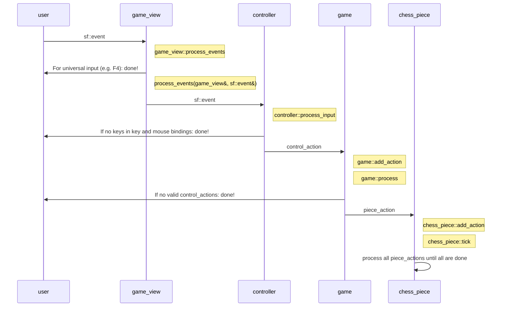

# Architecture

```mermaid
sequenceDiagram
    participant user
    participant game_view
    participant controller
    participant game
    participant chess_piece
    user->>game_view: sf::event
    Note right of game_view: game_view::process_events
    game_view->>user: For universal input (e.g. F4): done!
    Note right of game_view: process_events(game_view&, sf::event&)
    game_view->>controller: sf::event
    Note right of controller: controller::process_input
    controller->>user: If no keys in key and mouse bindings: done!
    controller->>game: control_action
    Note right of game: game::add_action
    Note right of game: game::process
    game->>user: If no valid control_actions: done!
    game->>chess_piece: piece_action
    Note right of chess_piece: chess_piece::add_action
    Note right of chess_piece: chess_piece::tick
    chess_piece->>chess_piece: process all piece_actions until all are done
```

