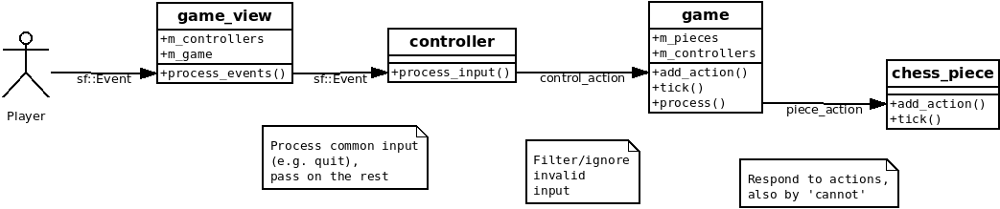
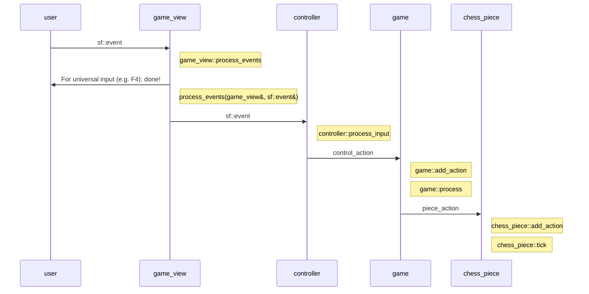
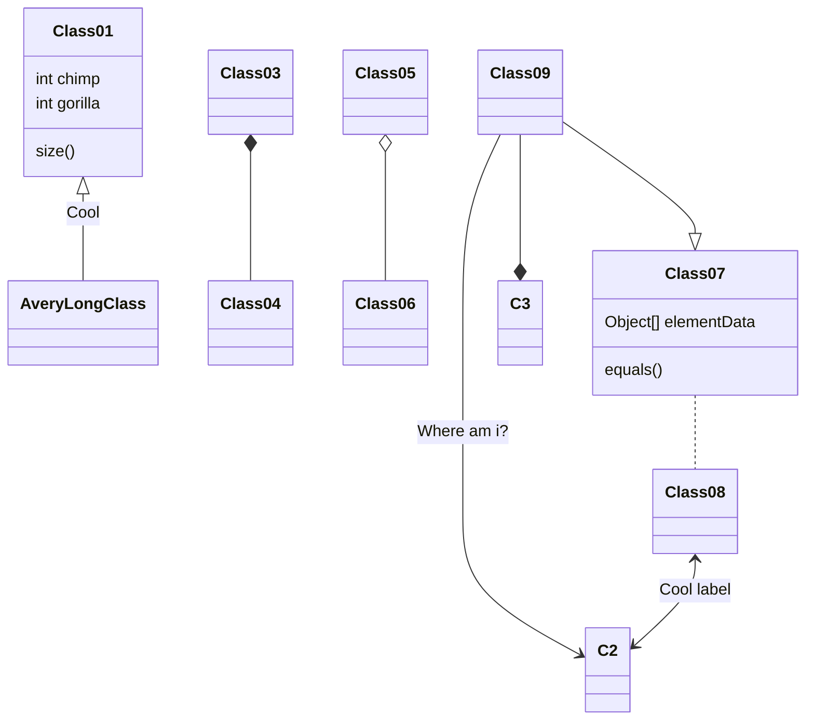

# Architecture

## Some tests

```mermaid
sequenceDiagram
    participant user
    participant game_view
    participant controller
    participant game
    participant chess_piece
    user->>game_view: sf::event
    Note right of game_view: game_view::process_events
    game_view->>user: For universal input (e.g. F4): done!
    Note right of game_view: process_events(game_view&, sf::event&)
    game_view->>controller: sf::event
    Note right of controller: controller::process_input
    controller->>game: control_action
    Note right of game: game::add_action
    Note right of game: game::process
    game->>chess_piece: piece_action
    Note right of chess_piece: chess_piece::add_action
    Note right of chess_piece: chess_piece::tick
```

## Some tests

```mermaid
graph TD;
    A-->B;
    A-->C;
    B-->D;
    C-->D;
```

```mermaid
classDiagram
Class01 <|-- AveryLongClass : Cool
Class03 *-- Class04
Class05 o-- Class06
Class07 .. Class08
Class09 --> C2 : Where am i?
Class09 --* C3
Class09 --|> Class07
Class07 : equals()
Class07 : Object[] elementData
Class01 : size()
Class01 : int chimp
Class01 : int gorilla
Class08 <--> C2: Cool label
```
