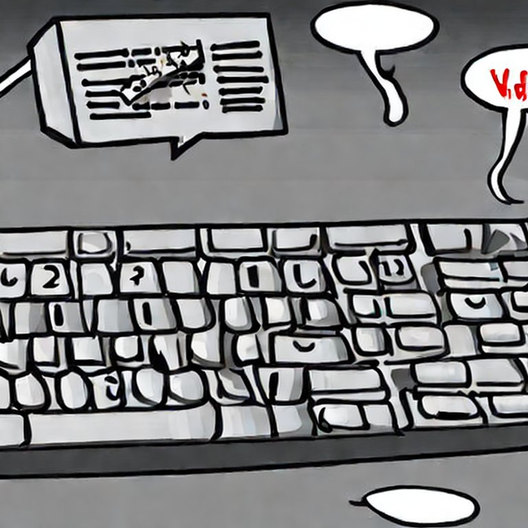

# Architecture

The key and mouse talk to `user_inputs`, or: `user_inputs` handles all the `sf::Event`s.
However, not all events are valid. For example, an LMB can be ignored if all players
use the keyboard. `user_inputs` only keeps the keys that are setup in the 
'Key Settings'/'Controls' dialog.

Input                   |Class                               |Output
------------------------|------------------------------------|---------------------------------------
keyboard and mouse input|`user_inputs`  |Store valid input, ignore invalid input

`game_controller` gets all `user_inputs` and moves the right cursor (there is one cursor
for each player) to the right spots. It can select a piece to do a chess move.

Input                   |Class                                       |Output
------------------------|--------------------------------------------|---------------------------------------
Valid input             |`game_controller`  |Moves the cursor, does chess moves

The chess moves that `game_controller` suggests may not be valid and do not
move pieces. `game` checks if the chess move is valid and if yes, does the move.

Input                   |Class                                       |Output
------------------------|--------------------------------------------|-----------------------------------------------------------
Chess  moves            |`game`                        |Performs the valid chess moves, ignores invalid chess moves
