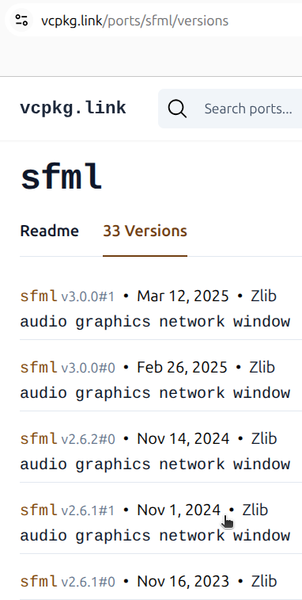
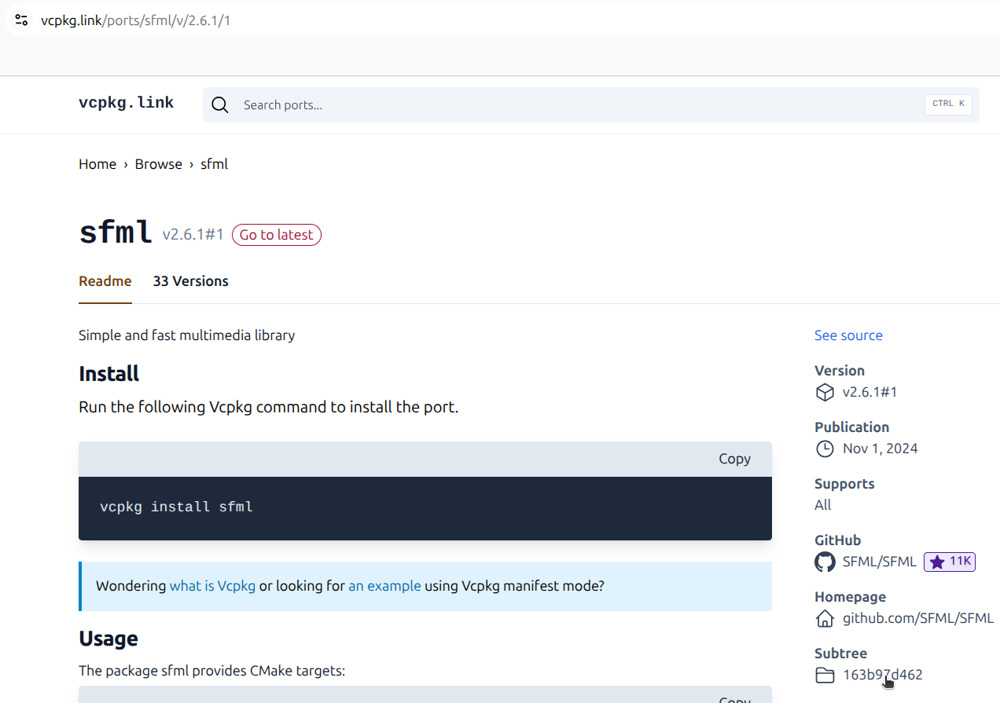
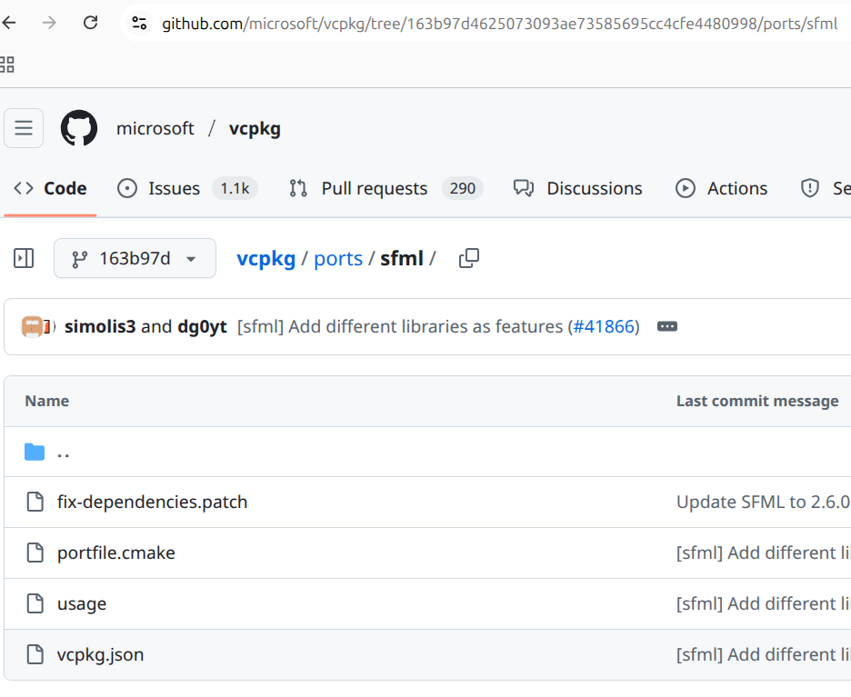

---
tags:
  - dev
  - developer
  - questions
  - answers
  - guide
---

# Developer guide

## How do you upload the non-standalone Linux executable?

In the Qt Creator project settings, use a shadow build,
which will put `conquer_chess` in the `build/Desktop-Debug`
folder.

That folder must have a symbolic link to the resources:

```bash
cd build/Desktop-Debug
ln -s ../../resources
```

Compile Conquer Chess in debug mode.

Then run `./scripts/run_steamcmd_to_upload.sh` to upload the executable
and resources.

## How do you upload the Windows executable?

Using an AppVeyor script that uploads the executable and
all required DLLs.

Then, download all these into the `windows_binary` folder.

Then run `./scripts/run_steamcmd_to_upload.sh` to upload these.

## How did you set the AppVeyor script to SFML 2.6.1?

- Search for `vcpkg SFML`
- Find [`https://vcpkg.link/ports/sfml`](https://vcpkg.link/ports/sfml)
- Click on the 30+ versions tab

- Click on SFML 2.6.1

??? question "How does that look like?"

  

- Click on 'Subtree'

??? question "How does that look like?"

  

- Extract the full commit number from the GitHub URL,
  in this case `163b97d4625073093ae73585695cc4cfe4480998`

??? question "How does that look like?"

  

## How did you generate the FEN strings

I often used <https://www.365chess.com/analysis_board.php>.

## How is the user input handled?

See [architecture](architecture/README.md)

## Where is the code documentation?

See [the Doxygen generated documentation](../docs/index.html).
