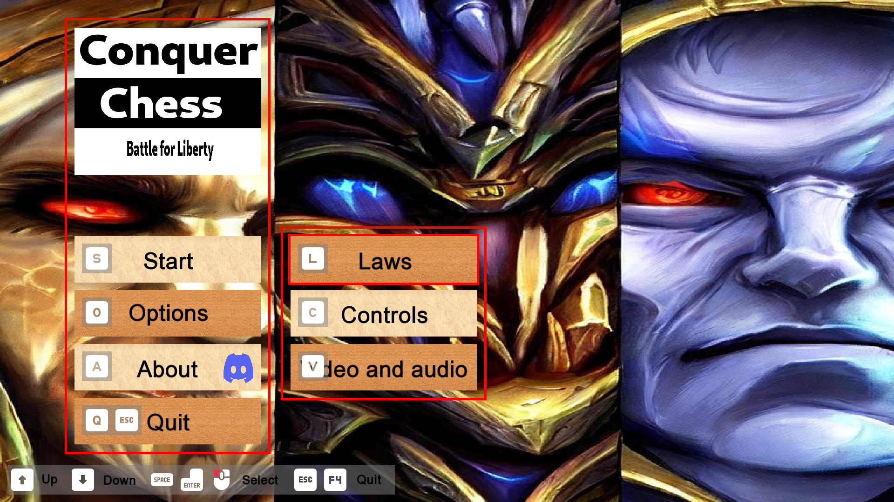

# Screenshots

## v0.9

> The menu screen

> The launch options you will need

> The 2025-07-31 Steam page

> Conquer Chess in the Steam store

> The replays screen shows the game statistics widget too

> The replays screen shows both statistics and board

> A mouse player cannot castle queenside if a piece is selected.

> A keyboard player cannot promote to a knight if a piece is selected.

> Second mock of the statistics screen

> First mock of the statistics screen

> A player can use the mouse

> Rooxx pieces have a shield next to a health bar

> During the first chess move, black cannot do anything

## v0.8

> The game screen shows a colored symbol behind the game info bars

> The game screen shows a symbol behind the game info bars

> The game screen shows a shield symbol on the protected pieces.

> The game screen shows the piece values (red), activity (green) and
> protectedness (blue) of the players.
> The upper bar shows the ration between the player,
> the middle bar the value of the left player,
> the lower bar the value of the right player.

> The game screen shows the relative strengths of the players,
> the percentage of pieces being active
> and the percentage of pieces being protected.

> The game screen shows the relative strengths of the players

> The game screen shows the time

> The game screen, now for rooxx (left) versus kingdom (right)

> The game screen for the classic pieces

> The menu screen

> The lobby screen

## v0.7

???- question "Version v0.7"

    

    > The Lobby screen in dog mode

    

    > The Main menu screen shows the controls

    

    > The Controls screen shows the mouse buttons too

    

    > The Controls screen looks prettier

    

    > The Lobby screen uses symbols to indicate the controls

    

    > The Lobby screen looks prettier

    

    > The Options screen looks prettier

    

    > The About screen looks prettier

    

    > The About screen shows names that are spelled correctly

    

    > The game title

    

    > There are multiple background images in the main menu

    

    > The main menu's background image fills the entire screen

    

    > The main menu screen is now full screen

    

    > Added symbols for the actions

    

    > Added symbols for the actions

    

    > Portraits are bigger

    

    > Show where pieces can go

## v0.6

???- question "Version v0.6"

    

    

## v0.5

???- question "Version v0.5"

    

    

    > The About screen does not show names yet that are spelled correctly

    

    

    

    

    

## v0.4

???- question "Version v0.4"

    

    

    

    

    

    

    

    

    

    

    

    

    

    

    

    

    

    

    

    

    

## v0.3

???- question "Version v0.3"

    

    

    

    

    

    

    

    

    

## v0.2

???- question "Version v0.2"

    

    

    

    

    

    

    

    

    

    

    

    

    

## v0.1

???- question "Version v0.1"

    

    

    

    

    

    

    

    

    

    

    

    

    
