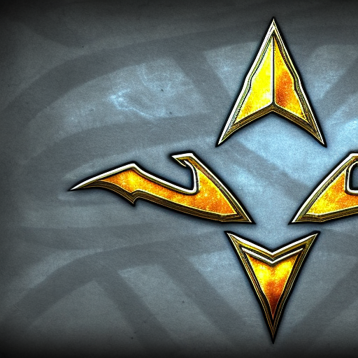

# resources

 * Fonts
 * Images
 * Sounds
 * Games

## Fonts

File                           |License
-------------------------------|--------------------------------------------------------------------
`CodeSquaredRegular-AYRg.ttf`  |[CC-SA by GuyStruct](code_squared_font_license/license-1f93.txt)                 
`16114_FuturistFixed-width.ttf`|None, from https://ttfonts.net/font/17388_FuturistFixed-width.htm

## Images

Image              |Description                         |Adapted from picture at URL
-------------------|------------------------------------|--------------------------------------------------------------------------------------
`kb_portrait.png`  |Prins Claus                         |https://commons.wikimedia.org/wiki/File:Prince_Claus_of_the_Netherlands_1986.jpg
`kw_portrait.png`  |Carl XVI Gustaf                     |https://commons.wikimedia.org/wiki/File:Carlos_Gustavo_da_Su%C3%A9cia_(meio_corpo).jpg
`qb_portrait.png`  |Queen Beatrix                       |https://commons.wikimedia.org/wiki/File:Queen_Beatrix_and_Wim_Pijbes.jpg
`qw_portrait.png`  |Silvia Renate Sommerlath            |https://commons.wikimedia.org/wiki/Category:Queen_Silvia_of_Sweden#/media/File:Queen_Silvia_of_Sweden_in_2018.jpg
`nw_portrait.png`  |Streiff                             |https://sv.wikipedia.org/wiki/Streiff#/media/Fil:Streiff_-_Livrustkammaren_-_32931.tif
Unused             |Hugo                                |https://commons.wikimedia.org/wiki/File:Oosterhout_-_Hugo_(1981)_van_Harry_Storms_-_1.jpg
`pw_portrait.png`  |Else Berg's 'Portrait of a farmer'  |https://commons.wikimedia.org/wiki/File:Else_Berg_Portrait_of_a_farmer.jpg
`pb_portrait.png`  |Axel Törneman's 'Farmer in Brittany'|https://commons.wikimedia.org/wiki/File:Farmer_in_Brittany_by_Axel_T%C3%B6rneman.jpg
`rw_portrait.png`  |Uppsala Slott                       |https://commons.wikimedia.org/wiki/Category:Uppsala_slott#/media/File:Schloss_Uppsala.jpg
`bw_portrait.png`  |Antje Jackeleen                     |https://commons.wikimedia.org/wiki/File:Biskopsvigning_2014-12-14_001.jpg
`bb_portait.png`   |Joris Vercammen                     |https://commons.wikimedia.org/wiki/File:Abp.Joris_Vercammen.png
`nb_portrait.png`  |Dom Quichote                        |https://commons.wikimedia.org/wiki/File:Bronze_statues_of_Don_Quixote_and_Sancho_Panza.jpg
`rb_portrait_1.png`|De Waag at night                    |https://commons.wikimedia.org/wiki/File:De_Waag,_Amsterdam.jpg
`rb_portrait_2.png`|De Waag at day                      |https://commons.wikimedia.org/wiki/File:Waag_Amsterdam_02.JPG

## Sounds

Sound              |Description                                            |URL
-------------------|-------------------------------------------------------|--------------------------------------------------------------------------------------
`hide.ogg`         |Hide sounds from Drakkar, by Sebastian Mader           |https://github.com/tresinformal/drakkar/blob/master/resources/hide.ogg

## Games

Game                |Description                                            |URL
--------------------|-------------------------------------------------------|--------------------------------------------------------------------------------------
`garry_kasparov.pgn`|Downloaded all first ?50 games                         |https://www.chess.com/games/garry-kasparov

## Stable Diffusion images

From [https://huggingface.co/spaces/stabilityai/stable-diffusion](https://huggingface.co/spaces/stabilityai/stable-diffusion):

### General artwork

Image                     |Filename              |Search terms
--------------------------|----------------------|---------------------------------------------------------------------
    |`protoss_head.jpeg`   |`starcraft 2, protoss, chess, simple, profile`
     |`terran_head.jpeg`    |`starcraft 2, terran, chess, face, chess piece, simple`
       |`zerg_head.jpeg`      |`starcraft 2, zerg, chess piece, face, simple, teeth`
     |`all_races_1.jpeg`    |`starcraft 2, chess, 1 protoss,  1 terran, 1 zerg, close-up, cubism`
     |`all_races_2.jpeg`    |`starcraft 2, chess, 1 protoss,  1 terran, 1 zerg, close-up, oil painting, three faces`
     |`all_races_3.jpeg`    |`starcraft 2, chess, 1 protoss,  1 terran, 1 zerg, close-up, oil painting, three faces, cubism`
     |`all_races_4.jpeg`    |`starcraft 2, chess, 1 protoss,  1 terran, 1 zerg, close-up, oil painting, three faces, cartoon`
 |`zerg_chessboard.jpeg`|`starcraft 2, zerg, chessboard, cubism, chess square`
            |`speed.png`           |`starcraft 2, speed, symbol, simple, cartoon`

### Chess color

Image                     |Filename              |Search terms
--------------------------|----------------------|---------------------------------------------------------------------
|`black_chess_color`   |`starcraft 2, black, landscape, desolate, terrain, cubism, cartoon`
|`white_chess_color`   |`starcraft 2, white, landscape, desolate, terrain, cubism, cartoon`

### Being ready

Image                          |Filename                   |Search terms
-------------------------------|---------------------------|---------------------------------------------------------------------
             |`ready_yes.png`            |`starcraft 2, thumb up, hand, simple, close-up, OK, yes, ready, go, symbol`
              |`ready_no.png`             |`starcraft 2, thumb down, hand, simple, close-up, no, symbol, red, wait`

### Chess pieces

Image                          |Filename                   |Search terms
-------------------------------|---------------------------|---------------------------------------------------------------------
   |`protoss_black_rook.jpeg`  |`black rook, chess, symbol, protoss, starcraft 2, simple, futuristic`
   |`protoss_white_rook.jpeg`  |`white rook, chess, symbol, protoss, starcraft 2, simple, futuristic`
    |`terran_black_rook.jpeg`   |`black rook, chess, symbol, terran, starcraft 2, simple`
    |`terran_white_rook.jpeg`   |`white rook, chess, symbol, terran, starcraft 2, simple`
      |`zerg_black_rook.jpeg`     |`black rook, chess, symbol, zerg, starcraft 2, simple, cells`
      |`zerg_white_rook.jpeg`     |`white rook, chess, symbol, zerg, starcraft 2, simple, biology`
 |`protoss_black_knight.jpeg`|`black knight, chess, protoss, starcraft 2, symbol`
 |`protoss_white_knight.jpeg`|`white knight, chess, protoss, starcraft 2, symbol, full body view, simple`
  |`terran_black_knight.jpeg` |`black knight, chess, terran, starcraft 2, symbol, human, full body view, simple`
  |`terran_white_knight.jpeg` |`white knight, chess, terran, starcraft 2, symbol`
    |`zerg_black_knight.jpeg`   |`black knight, chess, zerg, starcraft 2, symbol`
    |`zerg_white_knight.jpeg`   |`white knight, chess, zerg, starcraft 2, symbol, full body view`
